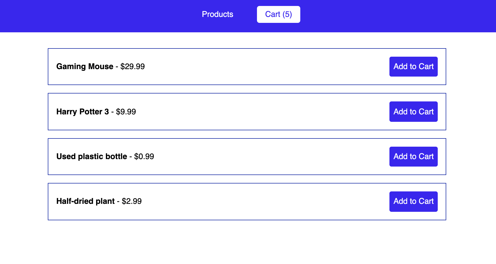

## Application is distributed within two different branches

- Redux Branch (Inludes the implementation of Redux code, for state management)
- Context API Branch (Inludes the implementation of Context API code, for state management)

## To install and run

- git clone https://github.com/Boro23-wq/contextAPI-vs-redux-state-management.git
- npm install (To install the required packages)
- npm start (To start the application)

## Application screen

